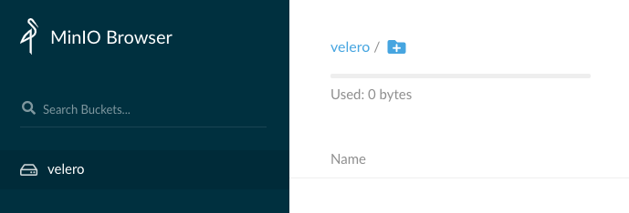
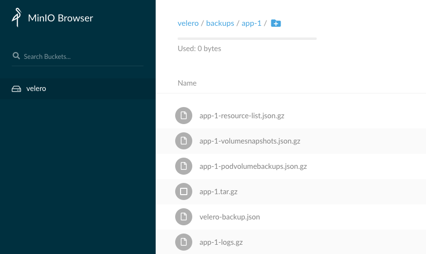

# Kubernetes Storage / State

This section will cover some very essential details to understanding Kubernetes storage. It is not comprehensive, but aimed at getting you up to speed to work with production environments asap.

## Setup

On top of Minikube and the base environment, we will be using 
- [Helm](https://helm.sh/)
- [yq](https://github.com/mikefarah/yq)

# Basics of Storage in Kubernetes

Now we are going to start from the ground up (kind of) which requires some basic knowledge.

## How does a Kubernetes Pod store state?

State is stored in *volumes*, aptly called *PersistentVolumes* (or *pv* for short).

Immediate question that might arise is; *where is that storage?* The simple answer is that there are lots of types of storage you can use and it depends on what you have setup. If working with Google's GKE or Amazon's EKS then you have a default setup to use GCE Persistent Disks and Elastic Block Store (EBS) respectively. If working with a homegrown cluster then storage plugins like [Ceph](https://ceph.io/) can be used to provide several backend storage types.

When you are in the cloud with a provider's *managed* Kubernetes storage, then things should be pretty straight forward.

## How does a Pod get access to state?

Most of the time when we will be creating volumes for pods to store state, we will use [*dynamic provisioning*](https://kubernetes.io/docs/concepts/storage/dynamic-provisioning/). The alternative is [*static provisioning*] and this was the 'old school' way before dynamic provisioning was available, but perhaps still has its use cases (please ask an expert!).

### Dyanmic Provisioning Workflow

This is a very rough high-level workflow, pretending we are in a cloud provider's *managed* kubernetes service (e.g. GKE or EKS):

1. Our pod requires a persistent volume, so we create a *PersistentVolumeClaim (PVC)* to basically say *"hey, I want a persistent volume!"*
2. A claim is only a claim, not actual storage (remember for that we need a PV (PersistentVolume)) so the claim should be attached to a PersistentVolume
3. Probably a PV does not exist yet... As we just created the PVC... and so the Cloud Controller will create a PersistentVolume using the specified storage type (e.g. GCE Persistent Disk or AWS's EBS) - this is a completely normal volume in the cloud provider, nothing specific to do with Kubernetes other than it is created, used [and possibly destroyed] by Kubernetes
4. Once the PV exists, the PVC gets attached to that PV, and the PVC can be mounted to a Pod... TADA!

In a nutshell:

PVC (*"I want a PV!"*) --> PV created --> PVC attaches itself to the PV --> Pod mounts PVC

Let's cover what happens after using practical exercises

### Static Provisioning Workflow

This was the original way to get persistent volumes, and required a cluster administrator to create Google or AWS volumes manually (e.g. GCE Persistent Disk or AWS EBS), and then create PersistentVolumes in Kubernetes essentially connecting those non-Kubernetes volumes to Kubernetes, allowing users to create PVCs that attach to those PVs.

## How do we tell Kubernetes which type of storage to use for the PV?

Short answer: *Storage Classes*. Let's just get practical and you'll see...

# Exercises

``` WARNING: some of this stuff will delete some default things in Minikube... Be ready to delete your instance and re-create afterwards ```

```bash
# let's just check you are in minikube
kubectl get no # no = nodes
# NAME       STATUS   ROLES    AGE   VERSION
# minikube   Ready    master   31m   v1.18.0
```

## Exercise 1 - Storage Classes

[Storage classes](https://kubernetes.io/docs/concepts/storage/storage-classes/) are ways to define different classes/types of available storage, and every PV is sort of like an instance of those. In GKE, the GCE Persistent Disk exists as *the default* storage class, and similarly in EKS, EBS is the default storage class

```bash
# taken from GKE
kubectl get sc # sc = storageclass
# NAME                 PROVISIONER            AGE
# standard (default)   kubernetes.io/gce-pd   34d
kubectl describe sc standard # see the ATTENTIONs added
# Name:                  standard
# IsDefaultClass:        Yes  # <-------------- ATTENTION
# Annotations:           storageclass.kubernetes.io/is-default-class=true
# Provisioner:           kubernetes.io/gce-pd # <--------------- ATTENTION
# Parameters:            type=pd-standard
# AllowVolumeExpansion:  True
# MountOptions:          <none>
# ReclaimPolicy:         Delete
# VolumeBindingMode:     Immediate
# Events:                <none>

# similarly from EKS
kubectl get sc
# NAME            PROVISIONER             AGE
# gp2 (default)   kubernetes.io/aws-ebs   41d
kubectl describe sc gp2
# Name:            gp2
# IsDefaultClass:  Yes
# Annotations:     kubectl.kubernetes.io/last-applied-configuration={"apiVersion":"storage.k8s.io/v1","kind":"StorageClass","metadata":{"annotations":{"storageclass.kubernetes.io/is-default-class":"true"},"name":"gp2"},"parameters":{"fsType":"ext4","type":"gp2"},"provisioner":"kubernetes.io/aws-ebs","volumeBindingMode":"WaitForFirstConsumer"}
# ,storageclass.kubernetes.io/is-default-class=true
# Provisioner:           kubernetes.io/aws-ebs
# Parameters:            fsType=ext4,type=gp2
# AllowVolumeExpansion:  <unset>
# MountOptions:          <none>
# ReclaimPolicy:         Delete
# VolumeBindingMode:     WaitForFirstConsumer
# Events:                <none>
```

What about in Minikube?

```bash
kubectl get sc
# NAME                 PROVISIONER                RECLAIMPOLICY   VOLUMEBINDINGMODE   ALLOWVOLUMEEXPANSION   AGE
# standard (default)   k8s.io/minikube-hostpath   Delete          Immediate           false                  37m
kubectl describe sc standard
# Name:            standard
# IsDefaultClass:  Yes
# Annotations:     kubectl.kubernetes.io/last-applied-configuration={"apiVersion":"storage.k8s.io/v1","kind":"StorageClass","metadata":{"annotations":{"storageclass.kubernetes.io/is-default-class":"true"},"labels":{"addonmanager.kubernetes.io/mode":"EnsureExists"},"name":"standard"},"provisioner":"k8s.io/minikube-hostpath"}
# ,storageclass.kubernetes.io/is-default-class=true
# Provisioner:           k8s.io/minikube-hostpath
# Parameters:            <none>
# AllowVolumeExpansion:  <unset>
# MountOptions:          <none>
# ReclaimPolicy:         Delete
# VolumeBindingMode:     Immediate
# Events:                <none>
```

## Exercise 2 - Creating our own Storage Class

1. Delete the existing storage class

```bash
kubectl delete sc standard
```

Now see what happens if you try to create a PVC?

```bash
kubectl apply -f storageclass/pvc.yaml
kubectl describe pvc sc-test-claim
# Name:          sc-test-claim
# Namespace:     default
# StorageClass:
# Status:        Pending
# ...
# Events:
#   Type    Reason         Age              From                         Message
#   ----    ------         ----             ----                         -------
#   Normal  FailedBinding  3s (x2 over 8s)  persistentvolume-controller  no persistent volumes available for this claim and no storage class is set
```

Without a storage class, we cannot create a volume. Surprised? :)

2. Let's create our own StorageClass called *"awesome-storage"*

```bash
# create awesome-storage storageclass
kubectl apply -f storageclass/storageclass.yaml

# then delete the PVC we created
kubectl delete -f storageclass/pvc.yaml

# set the pvc to use awesome-storage by adding
# spec.storageClassName: awesome-storage
# kubectl apply -f storageclass/pvc.yaml

# here we automate it and the leave the exercise for you!
# yq w storageclass/pvc.yaml spec.storageClassName awesome-storage | kubectl apply -f -

# TEST that it works:
kubectl get pvc # pvc = persistentvolumeclaim
# NAME            STATUS   VOLUME                                     CAPACITY   ACCESS MODES   STORAGECLASS      AGE
# sc-test-claim   Bound    pvc-80795c15-30ba-4e40-84c1-34fa028d46f0   4Gi        RWO            awesome-storage   41s

kubectl get pv # pv = persistentvolume
# NAME                                       CAPACITY   ACCESS MODES   RECLAIM POLICY   STATUS   CLAIM                   STORAGECLASS      REASON   AGE
# pvc-80795c15-30ba-4e40-84c1-34fa028d46f0   4Gi        RWO            Delete           Bound    default/sc-test-claim   awesome-storage            94s
```

## Exercise 3 - Re-attaching a PV

In this exercise we will look at what happens if we delete a PVC - does it delete the PV? Can we re-attach a PV to a PVC?

Good reading: https://kubernetes.io/docs/tasks/administer-cluster/change-pv-reclaim-policy/#why-change-reclaim-policy-of-a-persistentvolume

Copied from above:

*PersistentVolumes can have various reclaim policies, including “Retain”, “Recycle”, and “Delete”. For dynamically provisioned PersistentVolumes, the default reclaim policy is “Delete”. This means that a dynamically provisioned volume is automatically deleted when a user deletes the corresponding PersistentVolumeClaim. This automatic behavior might be inappropriate if the volume contains precious data. In that case, it is more appropriate to use the “Retain” policy. With the “Retain” policy, if a user deletes a PersistentVolumeClaim, the corresponding PersistentVolume is not be deleted. Instead, it is moved to the Released phase, where all of its data can be manually recovered.*

```bash
# first let's create a new namespace to work in
kubectl create ns dev # ns = namespace
# move to that namespace
kubens dev

# first we will create our DEFAULT storage class for future
kubectl apply -f reclaimpolicy/default-sc.yaml
# NAME                        PROVISIONER                RECLAIMPOLICY   VOLUMEBINDINGMODE   ALLOWVOLUMEEXPANSION   AGE
# awesome-storage             k8s.io/minikube-hostpath   Delete          Immediate           false                  30m
# default-storage (default)   k8s.io/minikube-hostpath   Delete          Immediate           false                  3s

# now we have two storage classes, and one is default. Notice also that even though we are in the dev namespace, both storageclasses still appear.
# Storage classes, along with many other resource types, are not scoped but are cluster wide resources

# create our PVC, which creates our PV, based on the specified storageclass (default)
kubectl apply -f reclaimpolicy/pvc.yaml
# persistentvolumeclaim/reclaim-pvc created
kubectl get pvc
# NAME          STATUS   VOLUME                                     CAPACITY   ACCESS MODES   STORAGECLASS      AGE
# reclaim-pvc   Bound    pvc-c3c31a9d-0aba-42c8-a77f-97174a9e278e   4Gi        RWO            default-storage   3s
kubectl get pv
# NAME                                       CAPACITY   ACCESS MODES   RECLAIM POLICY   STATUS   CLAIM                   STORAGECLASS      REASON   AGE
# pvc-80795c15-30ba-4e40-84c1-34fa028d46f0   4Gi        RWO            Delete           Bound    default/sc-test-claim   awesome-storage            21m
# pvc-c3c31a9d-0aba-42c8-a77f-97174a9e278e   4Gi        RWO            Delete           Bound    dev/reclaim-pvc         default-storage            30s

# going back to topic of cluster-wide resources, notice also that PVs are cluster wide... does that mean we could change the namespace of PVs? :)

# now let's delete the PVC and see what happens?
kubectl delete pvc reclaim-pvc
kubectl get pv # the PVC IS GONE! pooof! There goes our data...
# NAME                                       CAPACITY   ACCESS MODES   RECLAIM POLICY   STATUS   CLAIM                   STORAGECLASS      REASON   AGE
# pvc-80795c15-30ba-4e40-84c1-34fa028d46f0   4Gi        RWO            Delete           Bound    default/sc-test-claim   awesome-storage            23m
```

If we want to avoid the PV being deleted when the PVC is gone, maybe think about the RECLAIM POLICY = Delete. What does this mean?

Well... kinda obvious when you think about... when a PVC is deleted and the PV is left over, what should the reclamation policy be? E.g. delete it or keep it? Deletion is the default policy when using DYNAMIC PROVISIONING. So how do we change it?

The reclaim policy is NOT associated with the PVC, but is instead associated with the PV. The PV is created based on a storage class, following a request for a PVC. Hence we need to look at the storage class for the reclaim policy and not the PVC.

```bash
# let's update the default storage class
kubectl delete sc default-storage
# now update the reclamation policy for the storage class to use Retain... this is what you have to do

# this is the automated command, but you should modify the file yaml and
# kubectl apply -f reclaimpolicy/default-sc.yaml
# yq w reclaimpolicy/default-sc.yaml reclaimPolicy Retain | kubectl apply -f -
kubectl get sc # notice the Retain RECLAIMPOLICY
# NAME                        PROVISIONER                RECLAIMPOLICY   VOLUMEBINDINGMODE   ALLOWVOLUMEEXPANSION   AGE
# awesome-storage             k8s.io/minikube-hostpath   Delete          Immediate           false                  55m
# default-storage (default)   k8s.io/minikube-hostpath   Retain          Immediate           false                  9m1s

# now let's recate the pvc (and therefore pv)
kubectl apply -f reclaimpolicy/pvc.yaml

## NOTE - there seems to be a bug in Minikube... https://github.com/kubernetes/minikube/issues/3955
## Hence, reclaimpolicy is not carried across but we can update it manually

kubectl get pv
# NAME                                       CAPACITY   ACCESS MODES   RECLAIM POLICY   STATUS   CLAIM                   STORAGECLASS      REASON   AGE
# pvc-80795c15-30ba-4e40-84c1-34fa028d46f0   4Gi        RWO            Delete           Bound    default/sc-test-claim   awesome-storage            46m
# pvc-a537140b-fcd8-4e9a-af21-25d849d10a3f   4Gi        RWO            Delete           Bound    dev/reclaim-pvc         default-storage            8s

# copy the name of the PV we are interested in, in this case "pvc-a537140b-fcd8-4e9a-af21-25d849d10a3f"
kubectl patch pv pvc-a537140b-fcd8-4e9a-af21-25d849d10a3f -p "{\"spec\":{\"persistentVolumeReclaimPolicy\":\"Retain\"}}"
kubectl get pv
# NAME                                       CAPACITY   ACCESS MODES   RECLAIM POLICY   STATUS   CLAIM                   STORAGECLASS      REASON   AGE
# pvc-80795c15-30ba-4e40-84c1-34fa028d46f0   4Gi        RWO            Delete           Bound    default/sc-test-claim   awesome-storage            49m
# pvc-a537140b-fcd8-4e9a-af21-25d849d10a3f   4Gi        RWO            Retain           Bound    dev/reclaim-pvc         default-storage            2m42s

# now let's delete the PVC
kubectl delete pvc reclaim-pvc
kubectl get pv # notice now the STATUS of the PV we care about = Released
# NAME                                       CAPACITY   ACCESS MODES   RECLAIM POLICY   STATUS     CLAIM                   STORAGECLASS      REASON   AGE
# pvc-80795c15-30ba-4e40-84c1-34fa028d46f0   4Gi        RWO            Delete           Bound      default/sc-test-claim   awesome-storage            50m
# pvc-a537140b-fcd8-4e9a-af21-25d849d10a3f   4Gi        RWO            Retain           Released   dev/reclaim-pvc         default-storage            3m31s
kubectl get pvc # should be empty in dev namespace
```

Cool! So we have deleted a PVC and the PV has not been deleted... What if we want to reattach this PV to a PVC now? And in a different namespace just for kicks

```bash
# create prod namespace and set as active
kubectl create ns prod
kubens prod

# get the name of the PV
kubectl get pv
# NAME                                       CAPACITY   ACCESS MODES   RECLAIM POLICY   STATUS     CLAIM                   STORAGECLASS      REASON   AGE
# pvc-80795c15-30ba-4e40-84c1-34fa028d46f0   4Gi        RWO            Delete           Bound      default/sc-test-claim   awesome-storage            58m
# pvc-a537140b-fcd8-4e9a-af21-25d849d10a3f   4Gi        RWO            Retain           Released   dev/reclaim-pvc         default-storage            11m

# in our case, the name is "pvc-a537140b-fcd8-4e9a-af21-25d849d10a3f"
# add this to the reclaimpolicy/prod-pvc.yaml volumeName property and
# kubectl apply -f reclaimpolicy/prod-pvc.yaml
# yq w reclaimpolicy/prod-pvc.yaml spec.volumeName pvc-a537140b-fcd8-4e9a-af21-25d849d10a3f | kubectl apply -f -

# did it work? Probably not... Do you know why?

# seems the PV is RELEASED but still has a reference to a claim, so we need to remove this
# replace the pv name with your own pv
kubectl patch pv pvc-a537140b-fcd8-4e9a-af21-25d849d10a3f -p "{\"spec\":{\"claimRef\":null}}"

# now if we wait a bit... the PVC should be attached to the PV that we just made available
kubectl get pvc
# NAME               STATUS   VOLUME                                     CAPACITY   ACCESS MODES   STORAGECLASS      AGE
# prod-reclaim-pvc   Bound    pvc-a537140b-fcd8-4e9a-af21-25d849d10a3f   4Gi        RWO            default-storage   52m
```

## Exercise 4 - Backups (Advanced)

```
WARNING!
This exercise is pretty advanced. It requires setting up a few services using Helm and such...
Also it does not entirely work in minikube as the default storage type is hostPath and restic (the backup engine for PVs) does not support this volume type.
But if you run through this you will get a feeling for velero so it is easy to adapt to GKE/EKS
```

Usually we want to backup data that is valuable. The two common ways to do this:
1. Simply dumping filesystem or sql data and storing it somewhere (you take care of everything)
2. Using a tool to handle your backups

We are going with approach 2 and using [Velero](https://velero.io/)

For this exercise we are going to deploy 3 things:
1. Velero - the backup handler
2. Minio - the backend storage which will repliacte S3 storage from AWS
3. Example Application - a simple app that will write some data, and we need to back that data up

Let's use the ```dev``` namespace for this by running ```kubens dev```

```bash
# first install the helm repositories
helm repo add stable https://kubernetes-charts.storage.googleapis.com
helm repo add vmware-tanzu https://vmware-tanzu.github.io/helm-charts
```

### 4.1 Installing Minio

```bash
helm install minio stable/minio -f backups/minio-values.yaml --version 5.0.20
# if you need to delete minio simply run
helm delete minio

# check that the pod is running
# the READY should show 1/1 because we have one replica
watch kubectl get po

# once minio is running let's expose minio via minikube, the service type should be NodePort
minikube service minio -n dev

# login using the accessKey and secretKey specified in minio-values.yaml
# create a bucket called velero - this is where we will store backups
# now we are done with minio for now
```



### 4.2 Installing Velero


```bash
# make sure we have the URL to the minio service, e.g. http://192.168.64.3:31311
export MINIO_URL=http://192.168.64.3:31311 # or whatever minikube produced

# # we also need some credentials for velero, using kubernetes secrets
# kubectl create secret generic credentials --from-file=cloud=backups/credentials

helm install velero vmware-tanzu/velero \
  -f backups/velero-values.yaml \
  --set configuration.backupStorageLocation.config.s3Url=${MINIO_URL} \
  --version 2.9.13

# wait for the pod to be ready
watch kubectl get po

# check for any errors
kubectl logs velero-<name-of-pod>
```

Next we need to install the velero command line tool, which is used for restoring backups, as well as manually creating backups (and more)

Follow the instructions here: https://velero.io/docs/v1.3.2/basic-install/

```bash
velero version
# notice that velero by default uses the "velero" namespace and does not respect kubens
# hence I created this alias to simplify the following
alias v="velero -n dev"
v version
# still fails in my setup... anyway, dry your eyes...
# Client:
# 	Version: v1.3.2
# 	Git commit: -
# <error getting server version: timed out waiting for server status request to be processed>
```

Lets deploy our applicaiton next!


### 4.3 Example Application

```bash
kubectl apply -f backups/pvc.yaml
kubectl apply -f backups/pod.yaml

# wait for the app to be READY
watch kubectl get po

# check it is running
kubectl logs app
# ...
# Sun Apr 19 10:42:26 UTC 2020
# Sun Apr 19 10:42:31 UTC 2020
# Sun Apr 19 10:42:36 UTC 2020

# insert some manual data that we can check for after the restore
kubectl exec -ti app -- /bin/bash -c "echo THIS IS MANUALLY ADDED >> /data/out.txt"

# check contents of data file in persistent volume
kubectl exec -ti app -- /bin/bash -c "cat /data/out.txt"
# POD STARTED: Sun Apr 19 10:42:26 UTC 2020
# THIS IS MANUALLY ADDED
```

So in theory, if we backup this volume, delete the pod, pvc and pv, then restore the THIS IS MANUALLY ADDED line should still be there!

```bash
# according to the velero docs:

kubectl annotate pod/app backup.velero.io/backup-volumes=app-pvc

# create backup called app-1
velero -n dev backup create app-1 \
  --storage-location aws \
  --include-resources persistentvolumeclaims,persistentvolumes \
  --snapshot-volumes \
  --include-namespaces dev

# to watch for backups, use
watch velero -n dev backup get
# NAME    STATUS      CREATED                          EXPIRES   STORAGE LOCATION   SELECTOR
# app-1   Completed   2020-04-19 14:07:21 +0300 EEST   29d       aws                app=app

# describe
watch velero -n dev backup describe app-1

# logs
watch velero -n dev backup logs app-1

# if stuff fails you can always create app-n backup instead (increment the numbers), or
velero -n dev backup delete app-1
```

Ok cool! We have a backup (hopefully successful) now check back in minio through your web browser to see that backup:



Now let's delete our app, pvc and pv and restore this backup!

```bash
kubectl delete po app
kubectl delete pvc app-pvc
# double check that the PV is not there because of the reclaim policy :)

# lets restore
velero -n dev restore create --from-backup app-1

# check the pvc exists
kubectl get pvc
# NAME      STATUS   VOLUME                                     CAPACITY   ACCESS MODES   STORAGECLASS      AGE
# app-pvc   Bound    pvc-9f547a3d-a2a4-4d0d-aa7d-8785d213526f   4Gi        RWO            default-storage   3s

# now let's redeploy our app
kubectl apply -f backups/pod.yaml

# now let's check out persistent data
kubectl exec -ti app -- /bin/bash -c "cat /data/out.txt"
```

Did it work? NO! Because hostPath storage type is not supported by restic for security reasons and therefore the PVs are not backed up.
Hopefully this did not ruin your day too much. If you were using EKS or GKE then this would work as the storage type is supported...
I started looking into Rook and Ceph with minikube but then this becomes too much investment upfront. Anyway, the idea here was to show you how to use Velero and that much has been done.

Once you get into production then Velero has a nice scheduling system that can be used to schedule backups, e.g. every day and TTL (time to live) is 30 days.

Check the online documentation
